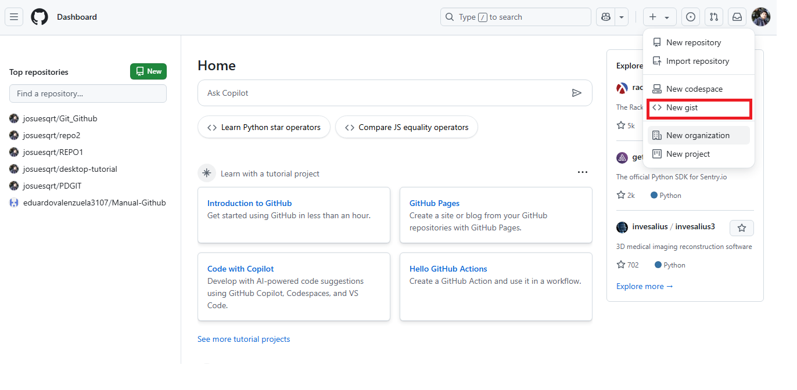
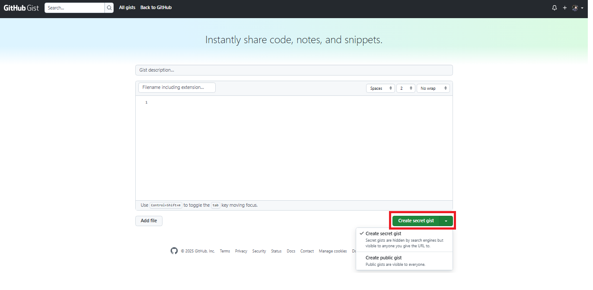

<!DOCTYPE html>
<html lang="es">
<head>
  <meta charset="UTF-8">
  <meta name="viewport" content="width=device-width, initial-scale=1.0">
  <title>Título Creativo con Fondo</title>
  <style>
    body {
      font-family: 'Segoe UI', Tahoma, Geneva, Verdana, sans-serif;
      background-color:rgba(252, 252, 255, 0.97);
      padding: 30px;
      line-height: 1.6;
      color: #333;
    }
    
    .container {
      max-width: 900px;
      margin: 0 auto;
    }
    
    .titulo-container {
      margin-bottom: 60px;
      padding: 25px;
      border-radius: 8px;
      background-color: white;
      box-shadow: 0 5px 15px rgba(0,0,0,0.1);
    }
    
    /* Título 3 - Creativo con Fondo */
    .titulo-3 {
      text-align: center;
      background:rgb(33, 203, 17);
      background: linear-gradient(to right,rgb(14, 236, 147),rgb(37, 116, 252));
      padding: 30px 20px;
      border-radius: 6px;
      color: white;
    }
    
    .titulo-3 h1 {
      font-size: 2.6rem;
      margin: 0;
      text-shadow: 2px 2px 4px rgba(7, 2, 2, 0.41);
      letter-spacing: 2px;
    }
    
    .titulo-3 p {
      margin-top: 10px;
      font-size: 1.1rem;
      opacity: 0.9;
    }
  </style>
</head>
<body>
  <div class="container">
    <div class="titulo-container">
      <div class="titulo-3">
        <h1>Issues</h1>
        <p>Guía rápida para Issues en GitHub</p>
      </div>
    </div>
  </div>
</body>
</html>

<h1><span style="color:green">Introducción</span></h1>
En esta guía se muestra cómo usar GitHub Issues para planear y realizar un seguimiento de un trabajo. En esta guía, creará una nueva incidencia y agregará una lista de tareas para realizar un seguimiento de las subtareas. También aprenderá a agregar etiquetas, hitos, personas asignadas y proyectos para comunicar metadatos sobre su problema. 

<h1><span style="color:green">Prerrequisitos</span></h1>
 * Creación de un nuevo repositorio.
 *  Deshabilitación de propuestas.

 <h1><span style="color:green">Abrir una incidencia en blanco</span></h1>
 Primero, crea un problema. En este ejemplo se usará la interfaz de usuario de GitHub. 
 1. En GitHub, vaya a la página principal del repositorio.
 2. Debajo del nombre del repositorio, haz clic en  Cuestiones.


3. Haga clic en Nuevo problema.
4. En este ejemplo, comenzaremos con un problema en blanco. Tu repositorio puede usar plantillas de incidencias y formularios de incidencias para animar a los colaboradores a proporcionar información específica.

<h1><span style="color:green">Cumplimentación de información</span></h1>
* Dale a tu número un título descriptivo.
* Agregue una descripción que explique el propósito del problema, incluidos los detalles que puedan ayudar a resolverlo.


<h1><span style="color:green">Adición de una lista de tareas</span></h1>

uede ser útil dividir los problemas grandes en tareas más pequeñas o viceversa.Haga referencia a los problemas existentes por número de problema o URL. Puede usar texto sin formato para realizar un seguimiento de las tareas que no tienen un problema correspondiente y convertirlas en problemas más adelante.


<h1><span style="color:green">Adición de etiquetas</span></h1>
Agregue una etiqueta para categorizar su problema. Por ejemplo,puede usar una etiqueta para indicar que un problema es un error que un colaborador por primera vez podría detectar. Los usuarios pueden filtrar

``` Git
 buggood first issue 
```
Puede utilizar las etiquetas predeterminadas o puede crear una nueva etiqueta.


<h1><span style="color:green">Adición de hitos</span></h1>
Puede agregar un hito para realizar un seguimiento del problema como parte de un objetivo basado en fechas. Un hito mostrará el progreso de los problemas a medida que se acerque la fecha objetivo.


 
<h1><span style="color:green">Asignación del problema </span></h1>
Para comunicar la responsabilidad, puede asignar el problema a un miembro de su organización.


## Agregar la propuesta a un proyecto 
<h1><span style="color:green">Agregar la propuesta a un proyecto  </span></h1>

Puede agregar la incidencia a un proyecto existente y rellenar los metadatos del proyecto. 


## Envío de su problema 
<h1><span style="color:green">Envío de su problema </span></h1>

Haga clic en Enviar nueva incidencia para crear la misma. Tu propuesta tiene una URL única que puedes compartir con los miembros del equipo o hacer referencia a ella en otras propuestas o solicitudes de extracción.

<h1><span style="color:green">Comunicante </span></h1>

Una vez creado el problema, continúe la conversación agregando comentarios al problema. Puedes @mention colaboradores o equipos para llamar su atención sobre un comentario.
 

<!DOCTYPE html>
<html lang="es">
<head>
  <meta charset="UTF-8">
  <meta name="viewport" content="width=device-width, initial-scale=1.0">
  <title>Título Creativo con Fondo</title>
  <style>
    body {
      font-family: 'Segoe UI', Tahoma, Geneva, Verdana, sans-serif;
      background-color:rgba(252, 252, 255, 0.97);
      padding: 30px;
      line-height: 1.6;
      color: #333;
    }
    
    .container {
      max-width: 900px;
      margin: 0 auto;
    }
    
    .titulo-container {
      margin-bottom: 60px;
      padding: 25px;
      border-radius: 8px;
      background-color: white;
      box-shadow: 0 5px 15px rgba(0,0,0,0.1);
    }
    
    /* Título 3 - Creativo con Fondo */
    .titulo-3 {
      text-align: center;
      background:rgb(33, 203, 17);
      background: linear-gradient(to right,rgb(14, 236, 147),rgb(37, 116, 252));
      padding: 30px 20px;
      border-radius: 6px;
      color: white;
    }
    
    .titulo-3 h1 {
      font-size: 2.6rem;
      margin: 0;
      text-shadow: 2px 2px 4px rgba(7, 2, 2, 0.41);
      letter-spacing: 2px;
    }
    
    .titulo-3 p {
      margin-top: 10px;
      font-size: 1.1rem;
      opacity: 0.9;
    }
  </style>
</head>
<body>
  <div class="container">
    <div class="titulo-container">
      <div class="titulo-3">
        <h1>Pull Request</h1>
        <p>Guía rápida para Pull Request en GitHub</p>
      </div>
    </div>
  </div>
</body>
</html>

Una solicitud de cambios es una propuesta para combinar un conjunto de cambios de una rama con otra. En una solicitud de cambios, los colaboradores pueden revisar y analizar el conjunto propuesto de cambios antes de integrar los cambios en el código base principal. Las solicitudes de cambios muestran las diferencias o la diferencias entre el contenido de la rama de origen y el contenido de la rama de destino.
  
Puedes crear solicitudes de incorporación de cambios en GitHub.com, con GitHub Desktop, en GitHub Codespaces, en GitHub Mobile y al usar GitHub CLI.

## ¿Por qué evitar cambios directos en la rama principal?
Modificar directamente la rama principal puede ocasionar varios problemas, como:

- Conflictos de código: Si varios colaboradores editan los mismos archivos en main, se pueden sobrescribir cambios entre sí.

- Errores en producción: Cambios no revisados o sin probar pueden introducir errores en versiones en vivo del proyecto.

- Falta de trazabilidad: Sin revisiones, es difícil verificar la calidad del código o entender el propósito de un cambio.

- Bloqueo del flujo de trabajo: Si la rama principal se rompe, todos los colaboradores pueden verse afectados.

## Pasos para crear y trabajar con un Pull Request
1. Crear una nueva rama local
Antes de comenzar una nueva funcionalidad o corrección, crea una rama desde la rama principal:
``` Git
git checkout main
git pull origin main
git checkout -b developer01
```
2. Realizar cambios y hacer commits
Haz los cambios necesarios y guarda tu progreso con commits claros y atómicos:
``` Git
git add .
git commit -m "Agrega validación de formulario de login"
```
3. Subir la rama al repositorio remoto (GitHub)
Una vez que los cambios están listos, sube la rama:
``` Git
git push -u origin developer01
```
4. Crear el Pull Request (PR)
- Ve al repositorio en GitHub.
- Verás un botón para “Compare & Pull Request” al subir la nueva rama.
- Describe los cambios en el cuerpo del PR: qué hiciste, por qué, y cualquier detalle útil.
- Asigna revisores, etiquetas y vincula el PR a una issue si corresponde.
## ¿Cómo se fusiona un Pull Request?
1. Comparación y Revisión Final  
Los revisores del equipo deben confirmar que los cambios funcionen como se espera, no rompen otras partes del sistema y cumplen con los estándares del proyecto. Además, se puede ver la comparación de cambios entre ramas en la pestaña del PR, lo que facilita detectar errores o mejoras antes del merge.
2. Resolver Conflictos  
GitHub detecta automáticamente si hay conflictos entre la rama del PR y la rama base. Dos posibles situaciones:
- Sin conflictos: Se muestra una marca verde y GitHub permite fusionar directamente.
- Con conflictos: Aparecerá un mensaje indicando que debes resolver conflictos manualmente.
3. Opciones de fusión  
- Merge Commit (por defecto): Crea un commit adicional de fusión. Útil para mantener el historial completo.
- Squash and Merge: Une todos los commits en uno solo. Recomendado para mantener un historial más limpio y legible.
- Rebase and Merge: Aplica los commits uno por uno sobre la rama base. Útil para mantener un historial lineal.
4. Eliminación de la Rama
Una vez que el PR ha sido fusionado:
- GitHub ofrecerá un botón para eliminar la rama remota usada en el PR.
- Esto no elimina la rama local en tu máquina, pero ayuda a mantener el repositorio remoto limpio y organizado.
- Si quieres eliminarla localmente también:
``` Git
git branch -d tu-rama
```

</style>
</head>
<body>
  <div class="container">
    <div class="titulo-container">
      <div class="titulo-3">
        <h1>Gist</h1>
        <p>Guía rápida para Gist en GitHub</p>
      </div>
    </div>
  </div>
</body>
</html>

## Acerca de Gist
<p> Una de las funciones más innovadoras de GitHub es Gist, que permite almacenar y distribuir fragmentos de código sin necesidad de configurar un repositorio completo.Cadenas de código, scripts de bash, Markdown, archivos de texto y otros pequeños fragmentos de datos son alternativas aceptables a los fragmentos de código. Permite distribuir rápidamente un fragmento de código a otros para cualquier propósito, como una demostración, un tutorial o cualquier solución, sin necesidad de configurar un repositorio estándar. </p>

## ¿Cómo crear un Gist?


 <b>*<h4>"Como alternativa,puedes arrastrar y soltar un archivo de texto desde tu escritorio directamente en el editor*"</h4></b>

<h2>Paso 1: </h2>

 Desde tu cuenta de [Github](https://github.com) , puedes elegir Nuevo gist en el Menú Crear o en el ícono más a la izquierda del ícono de tu perfil en la parte superior derecha de la ventana.

 


Si ya estás en el sitio web de GitHub gist , puedes crear gists fácilmente haciendo clic en el Menú Crear,pero tendrás dos opciones:

- **Create public gist**: Es visible para todos
- **Creat secret gist** : Es oculto para los buscadores
<br>
<br>
 

<h2>Paso 2: </h2>
En la sección de descripción del gist, puede introducir una descripción del gist (opcional).En la sección <b>"Nombre de archivo con extensión"</b>, introduzca el nombre del archivo. El nombre del archivo debe incluir la extensión, según el gist que cree. Por ejemplo, si crea un gist de ejemplo de Html, puede añadir la extensión .html al final del archivo, como codigoprueba.html .

[Ver documentación oficial](https://docs.github.com/en/get-started/writing-on-github/editing-and-sharing-content-with-gists/creating-gists)


<center><h1><span style="color:green">Code Spaces</span></h1></center>
GitHub Codespaces es un entorno de desarrollo en la nube totalmente integrado con GitHub, que te permite comenzar a programar de inmediato, sin necesidad de instalar herramientas o dependencias en tu equipo local. Cada codespace es una instancia de entorno de desarrollo basada en contenedores Docker que se ejecuta en una máquina virtual en la infraestructura de GitHub.  
Cada espacio de código que crees se aloja en GitHub en un contenedor Docker, ejecutándose en una máquina virtual. Puedes elegir entre varios tipos de máquinas virtuales, desde 2 núcleos, 8 GB de RAM y 32 GB de almacenamiento, hasta 32 núcleos, 64 GB de RAM y 128 GB de almacenamiento.

# Uso de GitHub Codespaces  
GitHub Codespaces te permite crear un espacio de código (codespace) a partir de una plantilla  o de cualquier rama o commit de un repositorio existente. Esto te da flexibilidad para empezar desde cero o trabajar con una versión específica del código.  
1. Crear un codespace desde un repositorio:  
- Ve al repositorio en GitHub.  
- Haz clic en el botón verde "Code" y luego en "Codespaces".  
- Selecciona "New codespace" y elige la rama desde la cual quieres iniciar.  
- GitHub creará el entorno de desarrollo automáticamente.  
2. Crear un codespace desde una plantilla:  
- Ve a github.com/codespaces y elige una plantilla prediseñada o en blanco.  
- Ideal para crear proyectos nuevos con una base preconfigurada.  
3. Reabrir un codespace existente:  
- Desde GitHub, visita la pestaña "Codespaces" de tu perfil o del repositorio.  
- Allí verás todos tus codespaces disponibles y podrás reabrir cualquiera.  

# Personalización de GitHub Codespaces
GitHub Codespaces permite crear entornos de desarrollo personalizados y consistentes para cada proyecto. Esto es especialmente útil cuando se trabaja en equipo o se manejan múltiples proyectos con requisitos técnicos distintos. Existen varias formas de adaptar el entorno de tu codespace a tus necesidades y preferencias, ya sea a nivel de proyecto o a nivel de usuario.
## Configuración del contenedor de desarrollo (devcontainer.json)
La forma más robusta de personalizar un codespace es mediante la configuración de contenedores de desarrollo. Esto se logra añadiendo una carpeta .devcontainer/ dentro del repositorio, con uno o más archivos de configuración, principalmente devcontainer.json.  
Esto permite definir de forma explícita:
- El sistema operativo base (imagen de contenedor)
- Las herramientas, bibliotecas o lenguajes a instalar automáticamente
- Extensiones de Visual Studio Code a incluir
- Comandos de instalación o configuración que se ejecutan al iniciar el entorno
- Variables de entorno y ajustes específicos del proyecto
## Uso de Dotfiles
Además de configurar el entorno del proyecto, los usuarios pueden personalizar su codespace de forma individual utilizando dotfiles. GitHub permite enlazar un repositorio público de dotfiles en tu cuenta, que se aplicará automáticamente a cualquier codespace que crees.
Los dotfiles permiten:
- Configurar preferencias de shell (.bashrc, .zshrc)
- Definir alias y funciones personalizadas
- Instalar herramientas o configuraciones propias
- Aplicar ajustes de Git, como nombre de usuario, editor predeterminado, etc.  
Puedes configurar esto desde tu perfil de GitHub, en la sección Codespaces > Dotfiles, y GitHub se encargará de clonar y aplicar el repositorio cada vez que inicies un nuevo codespace.
## Sincronización de configuración de VS Code
Si usas Visual Studio Code, también puedes activar la sincronización de configuración para mantener tu experiencia uniforme entre tu instalación local y los codespaces. Esta función sincroniza:  
- Temas y apariencia
- Atajos de teclado
- Fragmentos de código (snippets)
- Configuración del editor (settings.json)
- Extensiones instaladas  
Esto es especialmente útil si trabajas desde diferentes dispositivos o accedes a Codespaces desde el navegador, ya que te sentirás como si estuvieras trabajando en tu equipo local.

# Facturación y uso de Codespaces
- Cuentas personales
Todas las cuentas personales en GitHub, ya sean del plan Gratuito o Pro, incluyen una cuota mensual de uso gratuito de GitHub Codespaces. Puedes comenzar a usar esta función sin necesidad de configurar nada adicional ni proporcionar información de pago.  
Si creas un codespace desde un repositorio que pertenece a una organización, el consumo puede facturarse directamente a la organización si esta lo permite. En caso contrario, el uso se cobrará a tu cuenta personal. Una vez que superas el uso gratuito mensual, puedes continuar utilizando Codespaces agregando un método de pago y configurando un límite de gasto en tu cuenta.

- Organizaciones y empresas
Las organizaciones con planes GitHub Team o GitHub Enterprise pueden cubrir los costos de GitHub Codespaces para sus miembros y colaboradores. Esto se aplica específicamente a los codespaces creados a partir de repositorios propiedad de la organización.  
Cuando un codespace es facturado a la organización, esta se convierte en su propietaria y tiene la capacidad de eliminarlo si lo considera necesario. Además, las organizaciones pueden establecer límites de gasto y decidir quién es responsable de los pagos. La posibilidad de crear codespaces desde un repositorio de la organización puede depender de la visibilidad del repositorio y de la configuración establecida por la propia organización o empresa matriz.

# Casos de uso prácticos de GitHub Codespaces
GitHub Codespaces no solo agiliza la configuración del entorno, sino que abre posibilidades para escenarios de trabajo que antes requerían mucho tiempo o infraestructura adicional. A continuación encontrarás ejemplos de cómo aprovechar Codespaces en distintas situaciones reales:
1. Revisión rápida de Pull Requests:  
Al recibir una pull request, puedes abrir un codespace directamente desde esa rama para revisar, probar y depurar los cambios en un entorno aislado. Esto elimina la necesidad de clonar el repositorio, cambiar de rama o instalar dependencias localmente.
2. Onboarding de nuevos desarrolladores:  
Los nuevos miembros del equipo pueden empezar a trabajar de inmediato sin preocuparse por configurar el entorno de desarrollo. Con un codespace preconfigurado, todo está listo: lenguajes, dependencias, extensiones y configuraciones específicas del proyecto.
3. Contribuciones a proyectos open source:  
Los contribuidores externos pueden usar Codespaces para explorar, editar y probar proyectos open source sin necesidad de clonar el repositorio en su máquina local. Esto es ideal para quienes quieren aportar sin modificar su entorno local.
4. Pruebas en entornos aislados:  
Al crear un codespace, puedes replicar entornos de producción o testing sin afectar tu configuración local. Esto es útil para ejecutar pruebas específicas, depurar errores o verificar compatibilidades en diferentes versiones.
5. Desarrollo desde cualquier lugar:  
Como Codespaces se ejecuta en la nube y está disponible desde el navegador o VS Code, puedes continuar tu trabajo desde cualquier dispositivo con conexión a Internet, sin depender de tu equipo habitual.
6. Trabajo con múltiples proyectos:  
Si trabajas en diferentes proyectos con stacks distintos, puedes crear un codespace personalizado para cada uno. Esto evita conflictos de versiones de dependencias y mantiene tu entorno local limpio.
