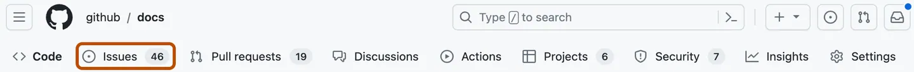
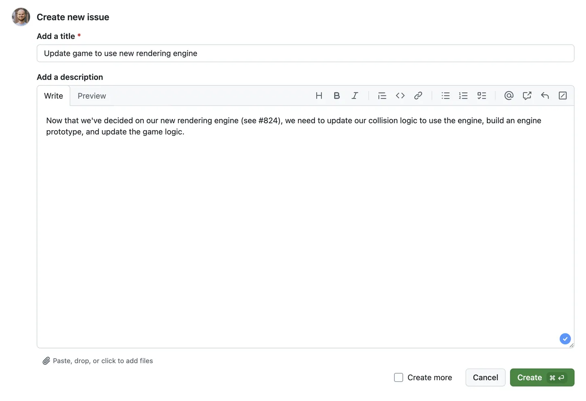
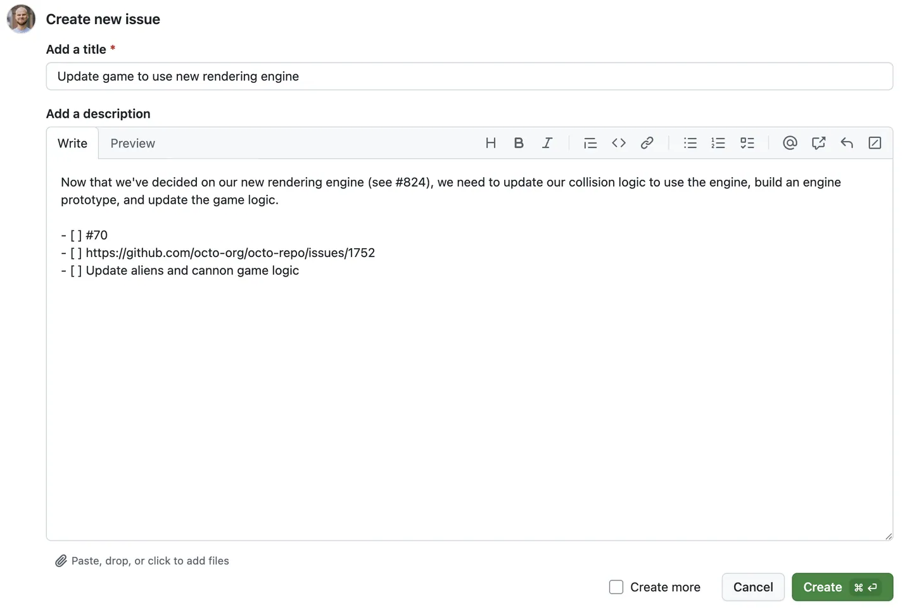
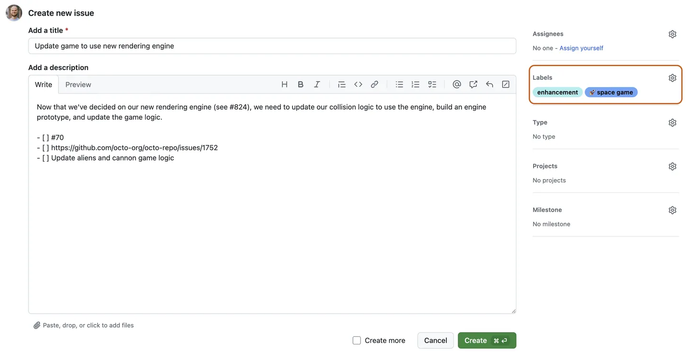
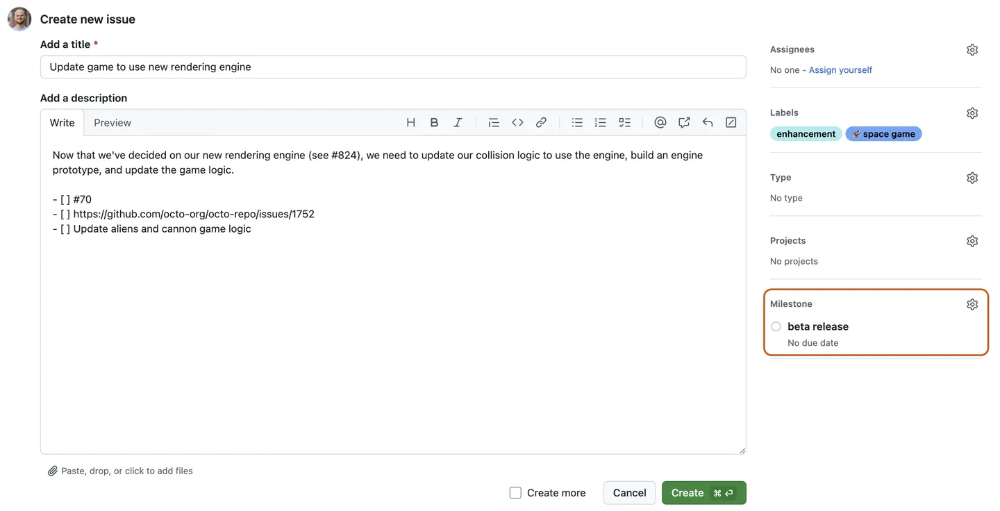
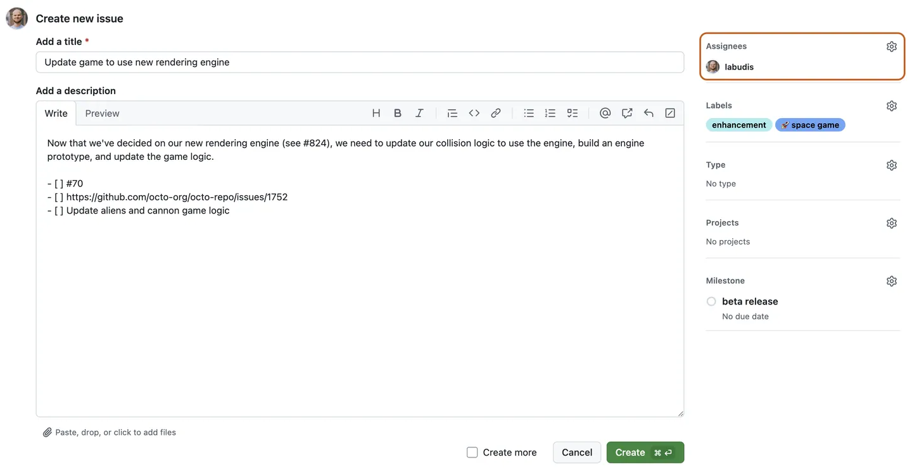
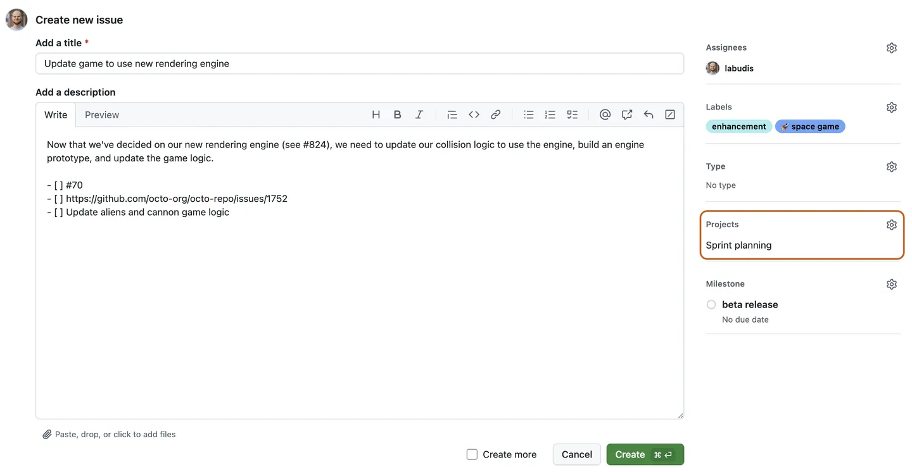
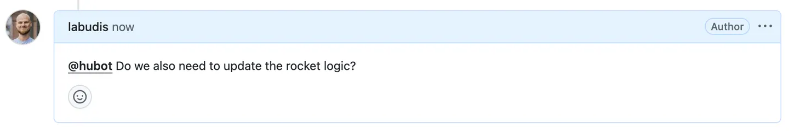

<!DOCTYPE html>
<html lang="es">
<head>
  <meta charset="UTF-8">
  <meta name="viewport" content="width=device-width, initial-scale=1.0">
  <title>Título Creativo con Fondo</title>
  <style>
    body {
      font-family: 'Segoe UI', Tahoma, Geneva, Verdana, sans-serif;
      background-color:rgba(252, 252, 255, 0.97);
      padding: 30px;
      line-height: 1.6;
      color: #333;
    }
    
    .container {
      max-width: 900px;
      margin: 0 auto;
    }
    
    .titulo-container {
      margin-bottom: 60px;
      padding: 25px;
      border-radius: 8px;
      background-color: white;
      box-shadow: 0 5px 15px rgba(0,0,0,0.1);
    }
    
    /* Título 3 - Creativo con Fondo */
    .titulo-3 {
      text-align: center;
      background:rgb(33, 203, 17);
      background: linear-gradient(to right,rgb(14, 236, 147),rgb(37, 116, 252));
      padding: 30px 20px;
      border-radius: 6px;
      color: white;
    }
    
    .titulo-3 h1 {
      font-size: 2.6rem;
      margin: 0;
      text-shadow: 2px 2px 4px rgba(7, 2, 2, 0.41);
      letter-spacing: 2px;
    }
    
    .titulo-3 p {
      margin-top: 10px;
      font-size: 1.1rem;
      opacity: 0.9;
    }
  </style>
</head>
<body>
  <div class="container">
    <div class="titulo-container">
      <div class="titulo-3">
        <h1>Issues</h1>
        <p>Guía rápida para Issues en GitHub</p>
      </div>
    </div>
  </div>
</body>
</html>

<h1><span style="color:green">Introducción</span></h1>
En esta guía se muestra cómo usar GitHub Issues para planear y realizar un seguimiento de un trabajo. En esta guía, creará una nueva incidencia y agregará una lista de tareas para realizar un seguimiento de las subtareas. También aprenderá a agregar etiquetas, hitos, personas asignadas y proyectos para comunicar metadatos sobre su problema. 

<h1><span style="color:green">Prerrequisitos</span></h1>
 * Creación de un nuevo repositorio.
 *  Deshabilitación de propuestas.

 <h1><span style="color:green">Abrir una incidencia en blanco</span></h1>
 Primero, crea un problema. En este ejemplo se usará la interfaz de usuario de GitHub. 
 1. En GitHub, vaya a la página principal del repositorio.
 2. Debajo del nombre del repositorio, haz clic en  Cuestiones.


3. Haga clic en Nuevo problema.
4. En este ejemplo, comenzaremos con un problema en blanco. Tu repositorio puede usar plantillas de incidencias y formularios de incidencias para animar a los colaboradores a proporcionar información específica.

<h1><span style="color:green">Cumplimentación de información</span></h1>
* Dale a tu número un título descriptivo.
* Agregue una descripción que explique el propósito del problema, incluidos los detalles que puedan ayudar a resolverlo.



<h1><span style="color:green">Adición de una lista de tareas</span></h1>

uede ser útil dividir los problemas grandes en tareas más pequeñas o viceversa.Haga referencia a los problemas existentes por número de problema o URL. Puede usar texto sin formato para realizar un seguimiento de las tareas que no tienen un problema correspondiente y convertirlas en problemas más adelante.


<h1><span style="color:green">Adición de etiquetas</span></h1>
Agregue una etiqueta para categorizar su problema. Por ejemplo,puede usar una etiqueta para indicar que un problema es un error que un colaborador por primera vez podría detectar. Los usuarios pueden filtrar

``` Git
 buggood first issue 
```
Puede utilizar las etiquetas predeterminadas o puede crear una nueva etiqueta.


<h1><span style="color:green">Adición de hitos</span></h1>
Puede agregar un hito para realizar un seguimiento del problema como parte de un objetivo basado en fechas. Un hito mostrará el progreso de los problemas a medida que se acerque la fecha objetivo.


 
<h1><span style="color:green">Asignación del problema </span></h1>
Para comunicar la responsabilidad, puede asignar el problema a un miembro de su organización.



## Agregar la propuesta a un proyecto 
<h1><span style="color:green">Agregar la propuesta a un proyecto  </span></h1>

Puede agregar la incidencia a un proyecto existente y rellenar los metadatos del proyecto. 


## Envío de su problema 
<h1><span style="color:green">Envío de su problema </span></h1>

Haga clic en Enviar nueva incidencia para crear la misma. Tu propuesta tiene una URL única que puedes compartir con los miembros del equipo o hacer referencia a ella en otras propuestas o solicitudes de extracción.

<h1><span style="color:green">Comunicante </span></h1>

Una vez creado el problema, continúe la conversación agregando comentarios al problema. Puedes @mention colaboradores o equipos para llamar su atención sobre un comentario.
 

<center><h1><span style="color:green">Pull Request</span></h1></center>
Una solicitud de cambios es una propuesta para combinar un conjunto de cambios de una rama con otra. En una solicitud de cambios, los colaboradores pueden revisar y analizar el conjunto propuesto de cambios antes de integrar los cambios en el código base principal. Las solicitudes de cambios muestran las diferencias o la diferencias entre el contenido de la rama de origen y el contenido de la rama de destino.
  
Puedes crear solicitudes de incorporación de cambios en GitHub.com, con GitHub Desktop, en GitHub Codespaces, en GitHub Mobile y al usar GitHub CLI.

## ¿Por qué evitar cambios directos en la rama principal?
Modificar directamente la rama principal puede ocasionar varios problemas, como:

- Conflictos de código: Si varios colaboradores editan los mismos archivos en main, se pueden sobrescribir cambios entre sí.

- Errores en producción: Cambios no revisados o sin probar pueden introducir errores en versiones en vivo del proyecto.

- Falta de trazabilidad: Sin revisiones, es difícil verificar la calidad del código o entender el propósito de un cambio.

- Bloqueo del flujo de trabajo: Si la rama principal se rompe, todos los colaboradores pueden verse afectados.

## Pasos para crear y trabajar con un Pull Request
1. Crear una nueva rama local
Antes de comenzar una nueva funcionalidad o corrección, crea una rama desde la rama principal:
``` Git
git checkout main
git pull origin main
git checkout -b developer01
```
2. Realizar cambios y hacer commits
Haz los cambios necesarios y guarda tu progreso con commits claros y atómicos:
``` Git
git add .
git commit -m "Agrega validación de formulario de login"
```
3. Subir la rama al repositorio remoto (GitHub)
Una vez que los cambios están listos, sube la rama:
``` Git
git push -u origin developer01
```
4. Crear el Pull Request (PR)
- Ve al repositorio en GitHub.
- Verás un botón para “Compare & Pull Request” al subir la nueva rama.
- Describe los cambios en el cuerpo del PR: qué hiciste, por qué, y cualquier detalle útil.
- Asigna revisores, etiquetas y vincula el PR a una issue si corresponde.
## ¿Cómo se fusiona un Pull Request?
1. Comparación y Revisión Final  
Los revisores del equipo deben confirmar que los cambios funcionen como se espera, no rompen otras partes del sistema y cumplen con los estándares del proyecto. Además, se puede ver la comparación de cambios entre ramas en la pestaña del PR, lo que facilita detectar errores o mejoras antes del merge.
2. Resolver Conflictos  
GitHub detecta automáticamente si hay conflictos entre la rama del PR y la rama base. Dos posibles situaciones:
- Sin conflictos: Se muestra una marca verde y GitHub permite fusionar directamente.
- Con conflictos: Aparecerá un mensaje indicando que debes resolver conflictos manualmente.
3. Opciones de fusión  
- Merge Commit (por defecto): Crea un commit adicional de fusión. Útil para mantener el historial completo.
- Squash and Merge: Une todos los commits en uno solo. Recomendado para mantener un historial más limpio y legible.
- Rebase and Merge: Aplica los commits uno por uno sobre la rama base. Útil para mantener un historial lineal.
4. Eliminación de la Rama
Una vez que el PR ha sido fusionado:
- GitHub ofrecerá un botón para eliminar la rama remota usada en el PR.
- Esto no elimina la rama local en tu máquina, pero ayuda a mantener el repositorio remoto limpio y organizado.
- Si quieres eliminarla localmente también:
``` Git
git branch -d tu-rama
```